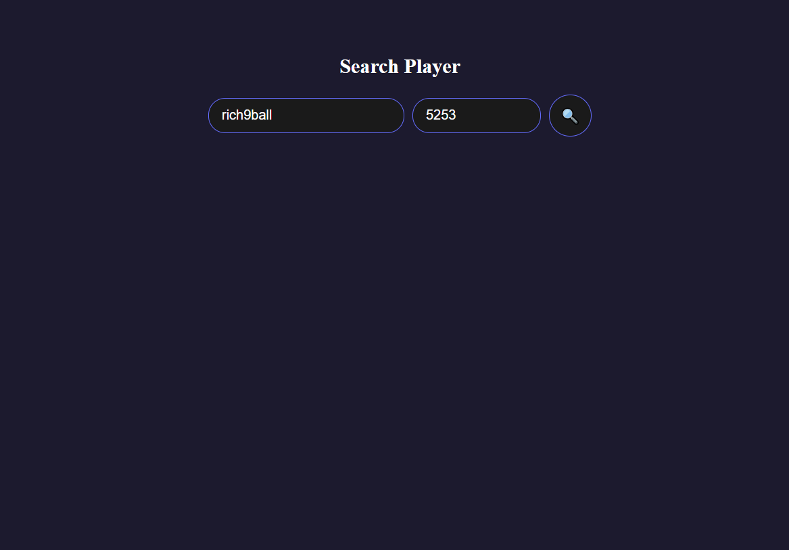
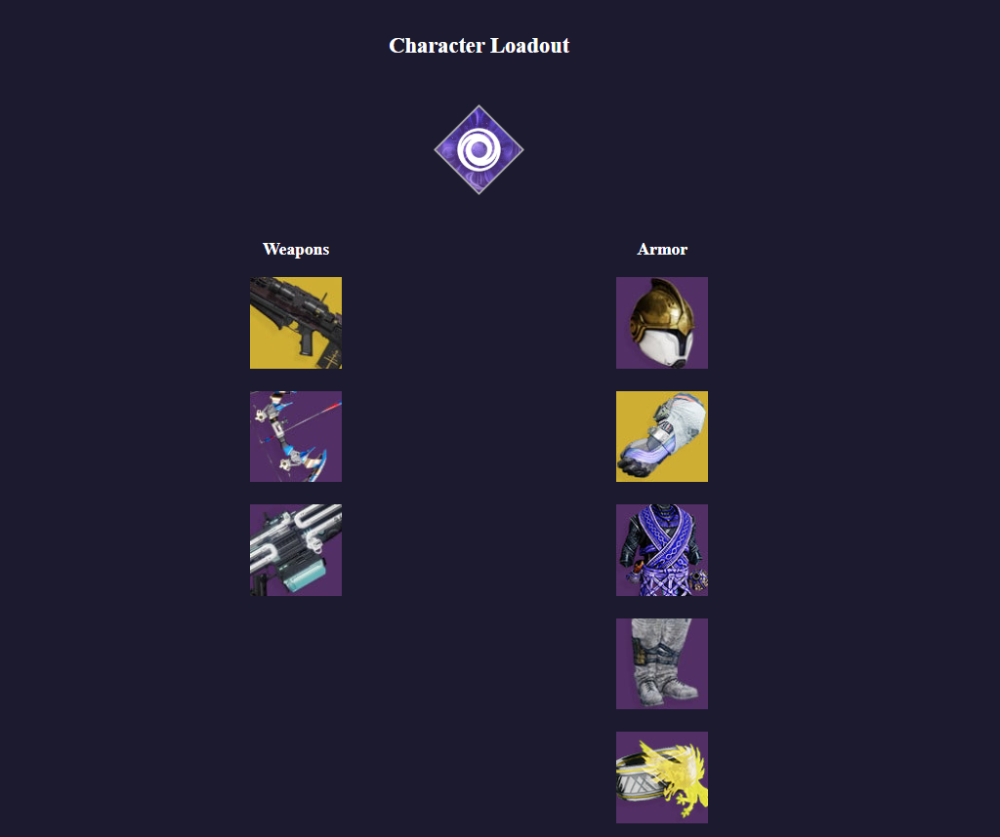
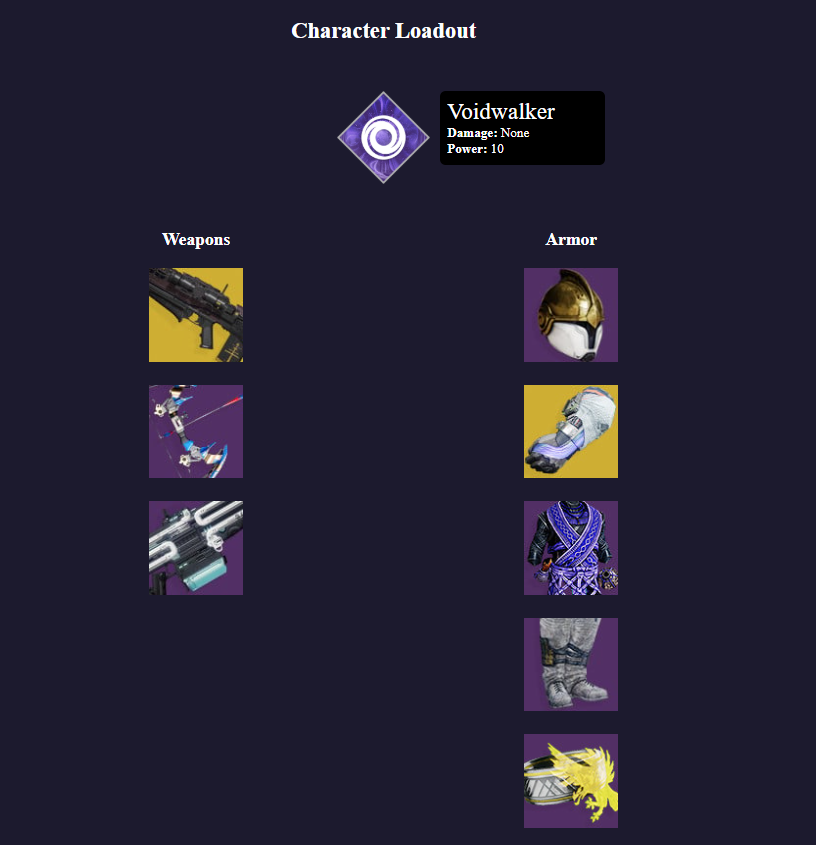
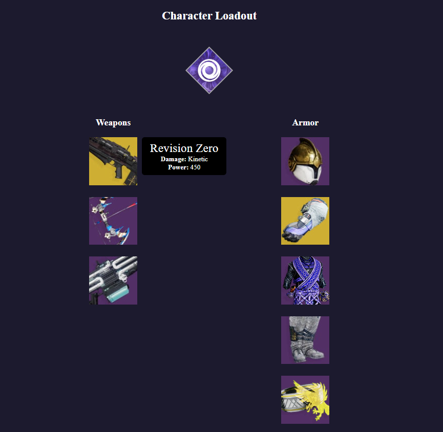

# Destiny 2 Player Lookup Dashboard

A full stack web application that lets you view and inspect your current Destiny 2 loadout after providing your Bungie.net username and four-digit player code

## Application Overview

### Home page
Here, the user can input their Bungie.net username and four-digit Player code

Once the user clicks search, their character emblem(s) will show up:

Clicking any of the emblems will take the user to the loadout page for that character. For this example, the warlock will be selected

### Loadout page

In the loadout page, the user can view the current loadout of the selected character, including subclass (top middle), weapons (left column), and armor (right column).

The user can also select an item to display its info. In this case, the subclass will be selected.

And now, the weapon on the top left:

And now, an armor piece:

